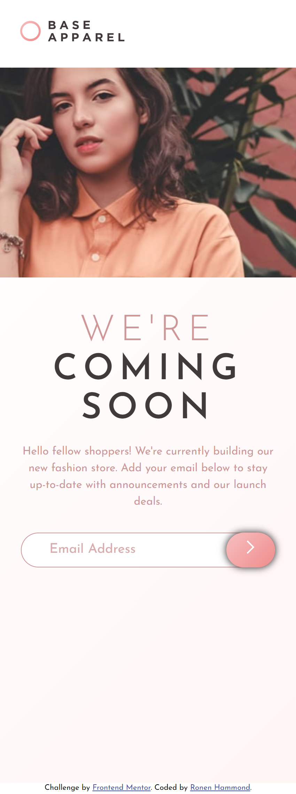
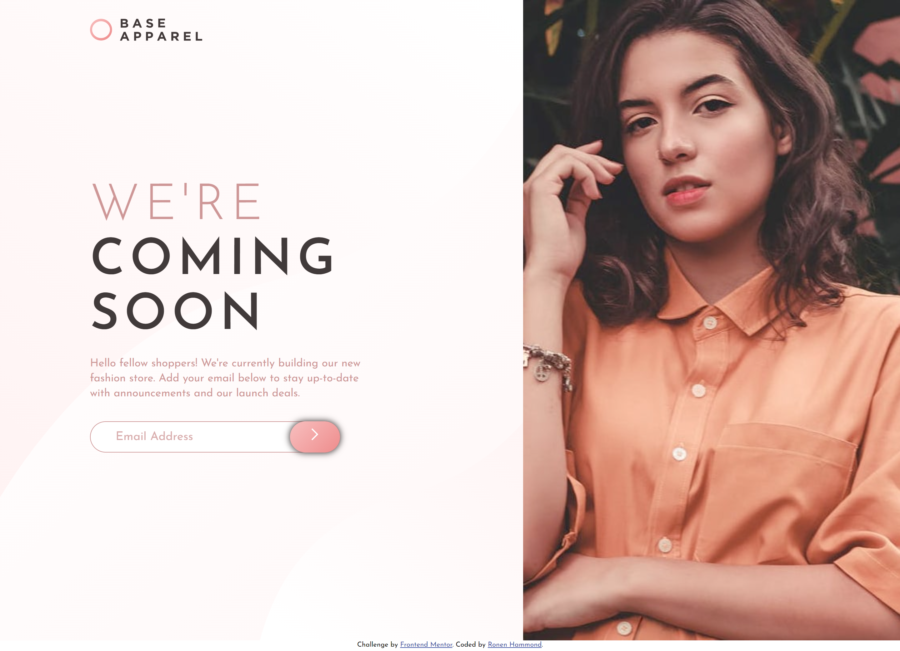

# Frontend Mentor - Base Apparel coming soon page solution

This is a solution to the [Base Apparel coming soon page challenge on Frontend Mentor](https://www.frontendmentor.io/challenges/base-apparel-coming-soon-page-5d46b47f8db8a7063f9331a0). Frontend Mentor challenges help you improve your coding skills by building realistic projects. 

## Table of contents

- [Frontend Mentor - Base Apparel coming soon page solution](#frontend-mentor---base-apparel-coming-soon-page-solution)
  - [Table of contents](#table-of-contents)
  - [Overview](#overview)
    - [The challenge](#the-challenge)
    - [Screenshot](#screenshot)
    - [Links](#links)
  - [My process](#my-process)
    - [Built with](#built-with)
    - [What I learned](#what-i-learned)
    - [Continued development](#continued-development)
    - [Useful resources](#useful-resources)
  - [Author](#author)

**Note: Delete this note and update the table of contents based on what sections you keep.**

## Overview

### The challenge

Users should be able to:

- View the optimal layout for the site depending on their device's screen size
- See hover states for all interactive elements on the page
- Receive an error message when the `form` is submitted if:
  - The `input` field is empty
  - The email address is not formatted correctly

### Screenshot

### Links

- Solution URL: [Solution URL](https://base-apparel-rgt.netlify.app/)
- Live Site URL: [Live Site URL](https://your-live-site-url.com)

## My process

### Built with

- Semantic HTML5 markup
- CSS custom properties
- Flexbox
- Mobile-first workflow

### What I learned

Learnt more about DOM manipulation.

### Continued development

Responsive layouts using Flexbox and Grid

### Useful resources

- [Example resource 1](https://stackoverflow.com/questions/46155/how-can-i-validate-an-email-address-in-javascript) - This helped me with validating the email input with JavaScript.
  
## Author

- Website - [Ronen Hammond](https://www.ronenhammond.me)
- Frontend Mentor - [@RonenTGreat](https://www.frontendmentor.io/profile/RonenTGreat)
- Twitter - [@Ronen_T_G](https://www.twitter.com/Ronen_T_G)
- LinkedIn - [Ronen Hammond](https://www.linkedin.com/in/ronen-hammond/)
